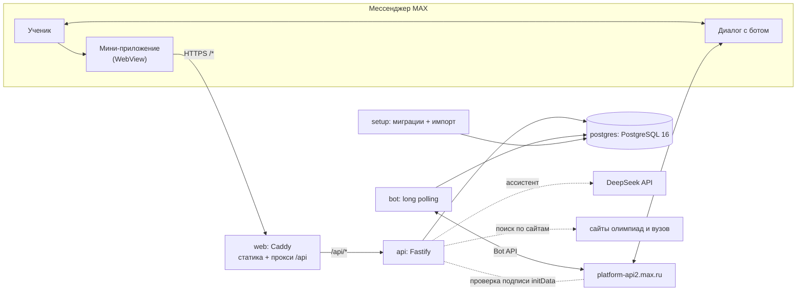

# Олимп — олимпиады и личный план в MAX

Мини-приложение и бот в мессенджере MAX, которые помогают школьнику найти подходящие олимпиады, понять, какие льготы они дают при поступлении, собрать личный план и не пропустить сроки регистрации и этапов.

| Для проверки | Где |
| --- | --- |
| Мини-приложение в MAX | `<ЗАПОЛНИТЬ: https://max.ru/<имя_бота>?startapp>` |
| Бот с напоминаниями | `<ЗАПОЛНИТЬ: https://max.ru/<имя_бота>>` |
| Публичный API | `<ЗАПОЛНИТЬ: https://<домен>/api>` · [openapi.yaml](openapi.yaml) · [DATA-API.yaml](DATA-API.yaml) |
| Локальный запуск | `docker compose up -d --build` → <http://localhost:8080> ([подробно](#запуск-одной-командой-через-docker)) |
| Тестовые логины и пароли, токены | Переданы в заявке; в репозитории их нет |

## Назначение решения

Сведения об олимпиадах разбросаны по сайтам организаторов, перечню РСОШ и правилам приёма вузов, а сроки регистрации легко пропустить. «Олимп» собирает их в одном месте внутри MAX:

- **Каталог** — 698 олимпиад с поиском и фильтрами по предмету, классу, формату, уровню и вузу; этапы, даты, документы и ссылки на источники; сравнение олимпиад.
- **Поступление** — уровни РСОШ, льготы 38 вузов (БВИ, 100 баллов), 294 направления подготовки и 2401 программа с экзаменами и проходными баллами; подборка олимпиад под цель ученика (вузы и направления).
- **Личный план** — сохранённые олимпиады, статусы («Планирую», «Зарегистрирован», «Участвую», «Завершено»), заметки, результаты этапов, календарь и подписка на него в календаре телефона.
- **Бот MAX** — сам пишет, когда подходит или переносится срок олимпиады из плана, по местному времени ученика; кнопка «Я зарегистрировался», команды `/plan` и `/settings`.
- **Ассистент «Олимп»** — отвечает на вопросы по каталогу, плану и льготам, при необходимости ищет на сайтах организаторов и вузов и приводит ссылки.

## Основной пользовательский сценарий

1. Ученик открывает бота в MAX и запускает мини-приложение — вход происходит через аккаунт MAX, без пароля.
2. Регистрируется: имя, класс, предметы, при желании — целевые вузы и направления.
3. В «Каталоге» находит олимпиады по своим предметам и классу, открывает карточку: этапы и даты, уровень, льготы в вузах, программы, источник.
4. Нажимает «Отслеживать» — олимпиада попадает в «План». Там ставит статус, пишет заметку, смотрит календарь сроков.
5. Нажимает «Подключить» — открывается бот. Когда до конца регистрации остаётся 7, 3, 1 день и в сам день, бот присылает напоминание; кнопка «✅ Я зарегистрировался» меняет статус в плане.
6. По ходу задаёт вопросы Олимпу («Какие олимпиады по информатике дают БВИ в МФТИ?») и открывает найденные карточки.

## Состав и архитектура



| Компонент | Путь | Что делает |
| --- | --- | --- |
| Мини-приложение | `apps/web` | React 19 + Vite + MAX UI; страницы, клиент API, MAX Bridge |
| API | `apps/api` | Fastify 5 + Zod + Drizzle; каталог, профиль, план, вход, ассистент; SQL-миграции и импорт данных |
| Бот | `apps/bot` | Команды и кнопки MAX, рассылка напоминаний; использует ту же базу и код API |
| Общие контракты | `packages/contracts` | Zod-схемы запросов и ответов для клиента и сервера |
| UI-компоненты | `packages/ui` | Кнопки, диалоги, иконки, стили |
| Данные | `data/` | Каталог olimpiada.ru, справочники РСОШ, льгот, программ, проверенные даты, FAQ |
| Инфраструктура | `Dockerfile`, `compose.yaml`, `compose.production.yaml`, `deploy/` | Образы, локальный и публичный запуск, Caddy |

В Docker Compose это пять сервисов: `postgres`, `setup` (одноразовый: миграции, импорт каталога и справочников, проверенные даты), `api`, `bot`, `web`.

## Запуск одной командой через Docker

```bash
git clone https://github.com/Gleb-hack/olimpmax.git && cd olimpmax
cp .env.example .env        # затем заполните JWT_SECRET и TEST_ACCOUNTS (или вставьте значения из заявки)
docker compose up -d --build
```

Для `JWT_SECRET` подойдёт вывод `openssl rand -hex 32`, для `TEST_ACCOUNTS` — например `student:придумайте-пароль`. Первый запуск собирает образы (1–2 минуты без учёта загрузки базовых образов) и за ~15 секунд загружает данные в базу. Затем:

- интерфейс — <http://localhost:8080>, вход кнопкой «Войти» тестовым логином и паролем;
- API — <http://localhost:8080/api>, проверка: `curl http://localhost:8080/api/health` → `{"status":"ok"}`;
- состояние сервисов — `docker compose ps -a`: `setup` завершён с кодом 0, `postgres` и `api` — `healthy`, `web` работает; `bot` работает, если задан `MAX_BOT_TOKEN`, иначе завершён с кодом 0.

Внутри MAX мини-приложение открывается только по публичному HTTPS-адресу, поэтому локальный запуск проверяется в браузере. Публикация на сервере с доменом и сертификатом — [docs/DEPLOYMENT.md](docs/DEPLOYMENT.md) (`compose.production.yaml`).

## Необходимые параметры окружения

- Docker Engine 24+ с Docker Compose v2.20+ (Docker Desktop на macOS/Windows подходит); ~2 ГБ свободной памяти и ~2 ГБ на диске для образов.
- Свободные порты `8080` (меняется через `WEB_PORT`) и `127.0.0.1:55432`.
- Доступ в интернет при сборке (npm-пакеты, базовые образы `node:22-bookworm-slim`, `caddy:2-alpine`, `postgres:16`).
- Для разработки без Docker: Node.js 22+, pnpm 11.25.0 (см. [раздел «Разработка»](#разработка)).

## Переменные окружения

Все переменные задаются в `.env` в корне (образец — [.env.example](.env.example), без рабочих значений). `compose.yaml` сам задаёт адрес базы, хост, порт и режим `production` для контейнеров.

| Переменная | Обязательна | Назначение |
| --- | --- | --- |
| `POSTGRES_PASSWORD` | да | Пароль базы (в образце — локальный `olimp-local-dev-only`) |
| `JWT_SECRET` | да | Подпись токенов сессии, не короче 32 символов |
| `TEST_ACCOUNTS` | для входа вне MAX | Тестовые учётные записи `логин:пароль` через запятую, пароль от 8 символов; пусто — вход по паролю выключен |
| `MAX_BOT_TOKEN` | для MAX и бота | Токен бота MAX: вход в мини-приложении, команды и напоминания. Пусто — бот не запускается |
| `DEEPSEEK_API_KEY`, `DEEPSEEK_MODEL` | нет | Ассистент «Олимп»; без ключа чат отвечает, что недоступен |
| `WEB_PORT` | нет | Порт интерфейса, по умолчанию `8080` |
| `BOT_REMINDER_HOUR`, `BOT_REMINDER_UNTIL_HOUR`, `BOT_CHECK_MINUTES`, `BOT_REMIND_ESTIMATED` | нет | Окно рассылки по местному времени ученика (16–21), частота проверки (15 мин), напоминать ли о датах с оценочным годом |
| `DATABASE_URL`, `HOST`, `PORT`, `NODE_ENV`, `CORS_ORIGIN`, `ALLOW_DEV_AUTH` | только для `pnpm dev` | Настройки разработки без Docker |

Для публичного сервера дополнительно нужен `APP_DOMAIN` — см. [.env.production.example](.env.production.example).

## Используемые порты

| Порт | Сервис | Доступ |
| --- | --- | --- |
| `8080` → 80 | `web` (Caddy): интерфейс и `/api/*` | локальный компьютер; меняется через `WEB_PORT` |
| `127.0.0.1:55432` → 5432 | `postgres` | только этот компьютер: для `pnpm dev` и интеграционных тестов |
| 3001 | `api` | только внутри сети Docker |
| 80, 443 | `web` в `compose.production.yaml` | публичный сервер, HTTPS |

Бот работает через long polling и портов не открывает.

## Зависимости

- **Интерфейс:** React 19.2, React Router 7, TanStack Query 5, Zustand 5, Vite 8, `@maxhub/max-ui` 0.5.
- **Сервер и бот:** Node.js 22, Fastify 5.12, Zod 4.6, Drizzle ORM 0.45 + `pg`, `@maxhub/max-bot-api` 0.3, `csv-parse`, `cheerio`, `unpdf`.
- **Инфраструктура:** PostgreSQL 16, Caddy 2, Docker Compose, pnpm 11.25 (workspace).

Точные версии всех пакетов зафиксированы в [pnpm-lock.yaml](pnpm-lock.yaml); сборка идёт с `pnpm install --frozen-lockfile`.

## Внешние сервисы и интеграции

Эти сервисы нельзя воспроизвести внутри Docker; без них остальная часть решения работает.

| Сервис | Зачем | Что нужно для проверки |
| --- | --- | --- |
| **Платформа MAX** (`platform-api2.max.ru`, MAX Bridge) | Запуск мини-приложения, проверка подписи данных входа, бот и доставка напоминаний | Бот в MAX, его `MAX_BOT_TOKEN` и публичный HTTPS-адрес приложения, привязанный к боту. Локальный запуск входит по `TEST_ACCOUNTS` |
| **DeepSeek API** | Ассистент «Олимп» | `DEEPSEEK_API_KEY`; каталог, план и бот работают без него |
| Сайты организаторов и вузов (`data/assistant/university_links_descriptions.csv`) | Поиск ассистента в интернете, если в базе нет ответа | Исходящий HTTPS из контейнера `api` |

Важно: MAX отдаёт обновления бота только одному получателю. Не запускайте локальный стек с токеном бота, который уже работает на сервере, — используйте отдельного тестового бота или оставьте `MAX_BOT_TOKEN` пустым.

## Работа с данными

- **Источники** (в репозитории, `data/`): выгрузка каталога olimpiada.ru (640 записей) и 58 дополнительных карточек; перечень РСОШ 2026/27; льготы 38 вузов; 2401 программа бакалавриата и специалитета; 352 проверенных этапа сезона 2026/27; FAQ. У каждой записи сохранена ссылка на источник. Подробно — [data/README.md](data/README.md), [data/reference/README.md](data/reference/README.md).
- **Загрузка:** сервис `setup` при каждом запуске выполняет `pnpm db:setup` — миграции, импорт каталога и справочников, проверенные даты. Импорт идемпотентен: обновляет каталог и не трогает личные планы и профили.
- **Хранение:** PostgreSQL в томе `olimp-postgres`. Пользовательские данные — `user_profiles` (профиль, цель, фото), `user_subjects`, `plan_items` (план, статусы, заметки, результаты), настройки напоминаний. Схема — [docs/DATA_MODEL.md](docs/DATA_MODEL.md).
- **Персональные данные:** из MAX берутся только идентификатор и имя; пароль MAX не запрашивается. «Профиль → Удалить аккаунт» (`DELETE /me`) удаляет профиль, план и настройки.
- **Даты:** у многих дат в источниках нет года — он подставляется по сезону 2026/27, такие даты помечены как оценочные. Проверенные даты хранятся отдельно.

## Работа с тестовыми данными

- **Учётные записи.** Вне MAX вход выполняется тестовыми учётными записями из `TEST_ACCOUNTS` (роль «ученик»; администратор не нужен). Каждый логин — отдельный пользователь со своим профилем и планом; с аккаунтами MAX они не пересекаются и сообщений бота не получают. Для проверки изоляции задайте два логина: `student:пароль1,student2:пароль2`.
- **Каталог** загружается автоматически из `data/` и одинаков при каждом запуске. Для проверок удобны: олимпиада `id=88` (ВсОШ по английскому языку), предмет `subjectIds=7` (информатика), вуз `mipt`, направление `01.03.02`.
- **Сброс.** Удалить данные одного тестового пользователя — «Профиль → Удалить аккаунт» или `DELETE /api/me`; при следующем входе он создаётся заново. Полностью очистить базу — `docker compose down -v` (удаляет том с базой), затем `docker compose up -d`.
- **Автопроверка API:** `STUDENT_LOGIN=student STUDENT_PASSWORD=<пароль> pnpm data-api:check http://localhost:8080/api` прогоняет все проверки [DATA-API.yaml](DATA-API.yaml) (нужен Node.js; без него — `docker compose run --rm --no-deps -e STUDENT_LOGIN -e STUDENT_PASSWORD api node scripts/check-data-api.mjs http://web/api`).

## Пошаговый сценарий проверки

**В MAX (основной сценарий)**

1. Откройте бота по ссылке из заявки и нажмите «Начать», затем «Открыть Olimp».
2. «Зарегистрироваться»: имя, класс 10, предмет «Информатика», вуз МФТИ → «Зарегистрироваться». Появится короткое обучение, его можно пропустить.
3. «Каталог» → фильтры «Предмет: Информатика», «Класс: 10» → откройте любую олимпиаду: этапы и сроки, уровень, блоки «Вузы с льготами» и «Куда поможет поступить», источник.
4. «Отслеживать» → вкладка «План»: олимпиада в списке; смените статус, добавьте заметку, переключитесь на «Календарь».
5. В «Плане» нажмите «Подключить» (бот) → в боте `/plan` покажет ближайшие сроки, `/settings` — настройки напоминаний.
6. Вкладка «Олимп» → «Спросить Олимпа»: «Какие олимпиады по информатике дают БВИ в МФТИ?» (если на сервере задан ключ DeepSeek).
7. Закройте и снова откройте мини-приложение — профиль и план на месте.

**Локально в браузере**

1. `docker compose up -d --build`, откройте <http://localhost:8080>.
2. «Зарегистрироваться» → имя, логин и пароль из `TEST_ACCOUNTS` → шаги 3–4 и 6 из сценария выше.
3. Перезагрузите страницу — сессия сохраняется; «Профиль → Выйти» возвращает на приветствие.

**API**

1. `curl http://localhost:8080/api/health` → `{"status":"ok"}`.
2. Получите токен: `curl -X POST http://localhost:8080/api/auth/test -H 'Content-Type: application/json' -d '{"login":"student","password":"<пароль>"}'`.
3. Выполните проверки [DATA-API.yaml](DATA-API.yaml) — вручную по [openapi.yaml](openapi.yaml) или командой `pnpm data-api:check` (см. выше).

## Примеры ожидаемого поведения

| Действие | Ожидаемый результат |
| --- | --- |
| `GET /api/health` | `200 {"status":"ok"}` |
| `GET /api/olympiads?subjectIds=7&grades=10` | `200`, `items` — олимпиады по информатике для 10 класса, `total`, `page`, `pageSize` |
| `GET /api/olympiads/999999999` | `404 {"error":"NOT_FOUND","message":"Олимпиада не найдена"}` |
| `GET /api/me/plan` без токена | `401 {"error":"UNAUTHORIZED",…}` |
| `POST /api/auth/test` с неверным паролем | `401 {"error":"INVALID_CREDENTIALS",…}`; в интерфейсе — «Неверный логин или пароль тестового аккаунта» |
| Повторная регистрация того же аккаунта | `409`, профиль не перезаписывается |
| `PUT /api/me/plan/88` дважды | оба раза `204`, в плане одна запись |
| План другого пользователя | не виден: у `student2` пустой план, изменение чужой записи — `404` |
| Повторный запуск `setup` / импорта | каталог обновляется, планы и заметки сохраняются |
| Олимпиада из плана, до конца регистрации 3 дня | в окно 16:00–21:00 по местному времени бот присылает напоминание с кнопкой «✅ Я зарегистрировался» |
| Бот получил свободный текст | предлагает открыть поиск или чат Олимпа в приложении с этим текстом |

## Известные ограничения

- Внутри MAX приложение открывается только по публичному HTTPS-адресу, привязанному к боту; локальный запуск проверяется в браузере с тестовым входом.
- У многих дат в источниках нет года: он рассчитывается по сезону 2026/27 и помечается как оценочный. Проверенные даты есть у 151 карточки. Сроки и льготы нужно сверять с организатором или вузом.
- Каталог обновляется импортом из `data/`, автоматической синхронизации с olimpiada.ru нет.
- Ассистент зависит от внешнего DeepSeek API и может ошибаться; карточки и ссылки в ответах берутся из базы по проверенным ID.
- Бот работает в одном экземпляре на токен (ограничение long polling в MAX).
- Выданный токен сессии действует час; серверного отзыва сессий нет. Тестовая сессия в браузере хранится до закрытия вкладки.

## Остановка и повторный запуск

```bash
docker compose stop             # остановить, контейнеры и данные сохраняются
docker compose start            # запустить снова
docker compose down             # удалить контейнеры; база остаётся в томе olimp-postgres
docker compose up -d            # поднять заново: setup обновит данные, планы сохранятся
docker compose up -d --build    # то же после изменения кода
docker compose down -v          # полностью удалить, включая базу
docker compose logs -f api bot  # журналы
```

После изменения `.env` выполните `docker compose up -d`, чтобы пересоздать контейнеры с новыми настройками.

## Разработка

Нужны Node.js 22+ и pnpm 11.25.0.

```bash
pnpm install --frozen-lockfile
cp .env.example .env              # JWT_SECRET, ALLOW_DEV_AUTH=true
cp apps/web/.env.example apps/web/.env
docker compose up -d --wait postgres
pnpm db:setup
pnpm dev                          # интерфейс http://127.0.0.1:5173, API :3001
```

| Команда | Назначение |
| --- | --- |
| `pnpm dev` / `pnpm dev:bot` | Интерфейс и API / бот в режиме разработки |
| `pnpm db:setup` | Миграции, импорт каталога и справочников, проверенные даты |
| `pnpm check` | Типы, модульные тесты, справочники, актуальность `openapi.yaml`, сборка |
| `pnpm test:integration` | API и импорт на PostgreSQL (нужен `DATABASE_URL` с правом `CREATEDB`) |
| `pnpm openapi` | Пересобрать `openapi.yaml` из схем маршрутов |
| `pnpm data-api:check [адрес]` | Прогнать проверки `DATA-API.yaml` |

GitHub Actions на каждый pull request выполняет проверки, интеграционные тесты, сборку Docker-образов без кэша с контролем времени (< 5 минут), запуск `docker compose` и прогон `DATA-API.yaml`.

## Документация

- [Публикация на сервере и подключение к MAX](docs/DEPLOYMENT.md) · [Работа с проектом](CONTRIBUTING.md)
- [Каталог и обновление данных](docs/CATALOG.md) · [Модель данных](docs/DATA_MODEL.md) · [API](docs/API.md)
- [Интерфейс](docs/FRONTEND.md) · [Вход](docs/AUTH.md) · [Ассистент](docs/ASSISTANT.md) · [Бот и напоминания](docs/BOT.md)
