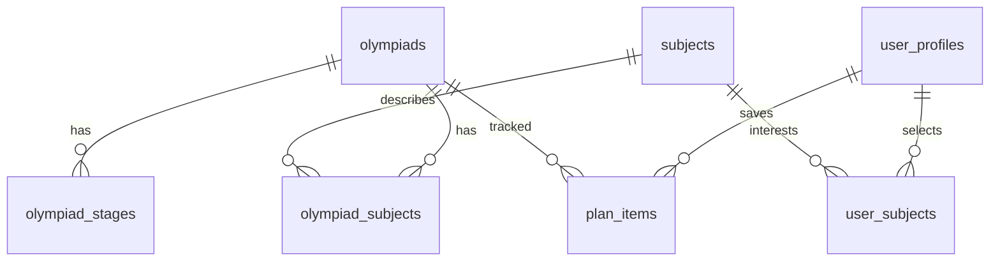

# Модель данных и происхождение значений

## Схема



| Таблица | Назначение и ключ |
| --- | --- |
| `olympiads` | ID страницы olimpiada.ru, нормализованная карточка, исходная строка JSONB, текст для поиска |
| `subjects` | Уникальный предмет, внутренний числовой ID |
| `olympiad_subjects` | Связь многие-ко-многим, уникальная пара олимпиада + предмет |
| `olympiad_stages` | Текстовый или проверенный этап; UUID, ключ внутри олимпиады и типа импорта |
| `user_profiles` | Внутренний UUID, уникальный ID MAX, имя MAX и профиля, класс, город, форматы, даты регистрации/обновления |
| `user_subjects` | Уникальная пара пользователь + предмет, два внешних ключа |
| `plan_items` | Уникальная пара пользователь + олимпиада, отслеживание, заметка |
| `import_runs` | История успешных импортов, SHA-256 файла, отчёт |

Внешние ключи запрещают планы и этапы для несуществующей олимпиады. Ограничения базы проверяют классы 1–11, рейтинг 0–10, порядок дат и наличие подтверждающих метаданных. Для поиска создан индекс `pg_trgm`, для предметов — обратный индекс связи, для классов и остальных фильтров — обычные индексы.

`UserProfile` содержит подтверждённую личность MAX и учебные предпочтения. Связи с предметами и планом обновляются только для пользователя из JWT. Таблица доставки напоминаний и бот пока не реализованы. Авторизация и миграция существующих аккаунтов описаны в [AUTH.md](AUTH.md).

## Соответствие CSV

| CSV | Поле базы / API |
| --- | --- |
| ID | `id`, совпадает с ID источника |
| Название | `title` |
| Предмет | `subjects`, связи; разделение по `;` |
| Классы | `classesRaw` |
| Класс от / Класс до | `gradeFrom` / `gradeTo`, целые числа вместо `8.0` |
| Формат | `onsite` / `online` / `hybrid` / `unknown` |
| Тип участия | `individual` / `team` / `mixed` / `unknown` |
| Рейтинг | `rating`, число или `null` |
| Статус | `statusRaw`, участвует в определении `scheduleStatus` |
| Календарь | `calendarRaw`, текстовые этапы |
| Расписание обновлено | `scheduleUpdatedRaw`, без выдуманного года |
| Организатор / Контакты / Документы | `organizers` / `contacts` / `documents`, текстовые списки |
| Описание | `description` или `null` |
| Особенности | `featuresRaw` |
| Источник | `sourceGroup` |
| URL | `sourceUrl`, проверяется соответствие ID |

Все значения также сохраняются в `rawSource` как исходная строка из 19 полей. Стрелка `→` удаляется только из нормализованных списков; в исходных значениях остаётся. Похожие названия предметов не объединяются автоматически. Из неполных контактов не восстанавливаются URL.

Сначала проверяется статус «не проводится» в календаре **или** статусной строке. Поэтому таких олимпиад 131, хотя сам текст календаря «В этом году олимпиада не проводится» встречается 129 раз. 8 текстовых этапов имеют дату без названия; их `name=null`, а исходный календарь доступен полностью.

## Проверенные даты

Ниже **шаблон**, а не готовые данные. Вместо заполнителей укажите сведения, которые вы проверили у организатора. Не запускайте импорт шаблона как реального расписания.

```json
[
  {
    "olympiadId": 88,
    "key": "<стабильный-ключ-сезона-и-этапа>",
    "name": "<Название этапа>",
    "kind": "competition",
    "beginsOn": null,
    "endsOn": "<YYYY-MM-DD>",
    "sourceUrl": "<https://официальный-сайт/расписание>",
    "verifiedAt": "<YYYY-MM-DDTHH:mm:ss+03:00>",
    "verifiedBy": "<Кто проверил>"
  }
]
```

`kind`: `registration`, `competition` или `other`. Нужна хотя бы одна дата; обе должны содержать год. Импорт проверяет календарную корректность, порядок и дату проверки, но достоверность расписания остаётся ответственностью проверяющего. `verifiedAt` не может быть в будущем. Для олимпиад `not_held` импорт запрещён до обновления каталога.

`key` должен включать сезон, например `2026-27-school-english`. Повторная загрузка того же ключа меняет тот же этап, сохраняя UUID. Новые ключи добавляют этапы. Отсутствие ключа в файле ничего не удаляет: файл может быть частичным. Если опубликовано исправление или отмена, оператор должен изменить соответствующий этап; для отмены можно перевести его в `needs_review` через Drizzle/SQL. Интерфейс администрирования пока не реализован.

У этапов из CSV всегда `origin=csv`, `verification=unverified`, даты `null`. У проверенных — `origin=verified_import`, `verification=verified`, заполнены источник и метаданные проверки. Это разные записи: частично проверенный календарь не маскируется под полностью подтверждённый.

Проверенные даты привязаны к хешу текстов календаря, статуса и отметки обновления на момент проверки. При изменении этих полей очередной CSV-импорт переводит такие даты в `needs_review`. Возврат исходного текста сам по себе не подтверждает их повторно: нужна новая проверка и загрузка.

## Ограничения актуальности

Источник CSV — разовая выгрузка; время импорта не равно времени проверки источника. Отслеживание в API означает сохранённую олимпиаду и вычисление событий по уже известным датам. Планировщик обновления источников, проверка отмен и доставщик напоминаний не реализованы. До их добавления актуальность поддерживает оператор.
